# QuietLounge

네이버 라운지(`lounge.naver.com`)에서 특정 유저의 게시글을 숨기는 클라이언트 사이드 차단 도구.

[](https://qr.kakaopay.com/FG31jvTdV)

---

## 왜 만들었나

네이버 라운지에는 유저 차단(뮤트) 기능이 없다. 커뮤니티 특성상 반복적으로 불쾌한 글을 올리는 유저가 있어도, 매번 눈으로 걸러내는 수밖에 없다.

QuietLounge는 이 문제를 **클라이언트 단에서** 해결한다.

- 네이버 서버를 거치지 않는다. 로그인 세션이나 개인정보가 외부로 나가지 않는다.
- 닉네임이 아닌 **personaId**(고유 ID)로 차단하므로, 닉네임을 바꿔도 차단이 유지된다.
- Chrome 확장 프로그램, Safari 확장 프로그램(macOS/iOS), Android 앱으로 배포한다.

---

## 다운로드

[Releases](https://github.com/konempty/QuietLounge/releases)에서 최신 버전을 다운로드할 수 있다.

| 플랫폼              | 파일                                | 비고                                   |
|------------------|-----------------------------------|--------------------------------------|
| PC (Chrome 등)    | `QuietLounge-ChromeExtension.zip` | Chromium 계열 브라우저 모두 지원               |
| macOS/iOS Safari | Source code → Xcode 빌드            | 코드 사인 필요, Apple 개발자 계정으로 직접 빌드/설치    |
| Android          | `QuietLounge-Android.apk`         | Android 7.0 이상                       |

---

## PC 설치 방법 (Chrome 확장 프로그램)

### 1. 파일 다운로드

위 [다운로드](#다운로드) 링크에서 `chrome-extension.zip`을 받고 압축을 푼다.

### 2. 크롬에 설치

Chrome 주소창에 `chrome://extensions`를 입력한다.

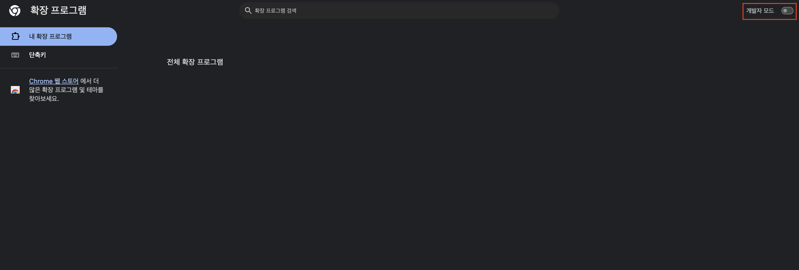

오른쪽 위 **개발자 모드** 토글을 켠다.

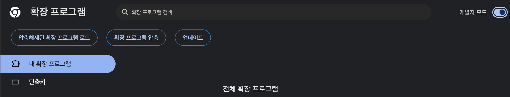

**압축해제된 확장 프로그램을 로드합니다** 버튼을 클릭하고, 압축을 풀었던 폴더를 선택한다.

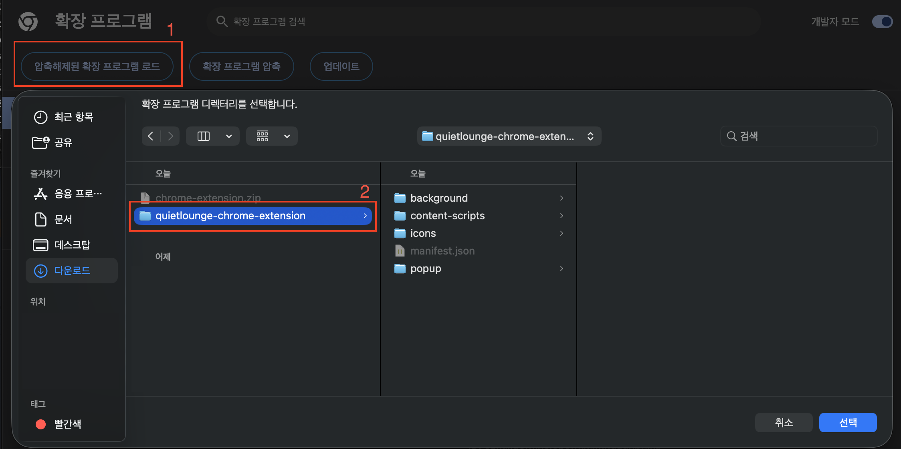

QuietLounge가 목록에 나타나면 설치 완료.

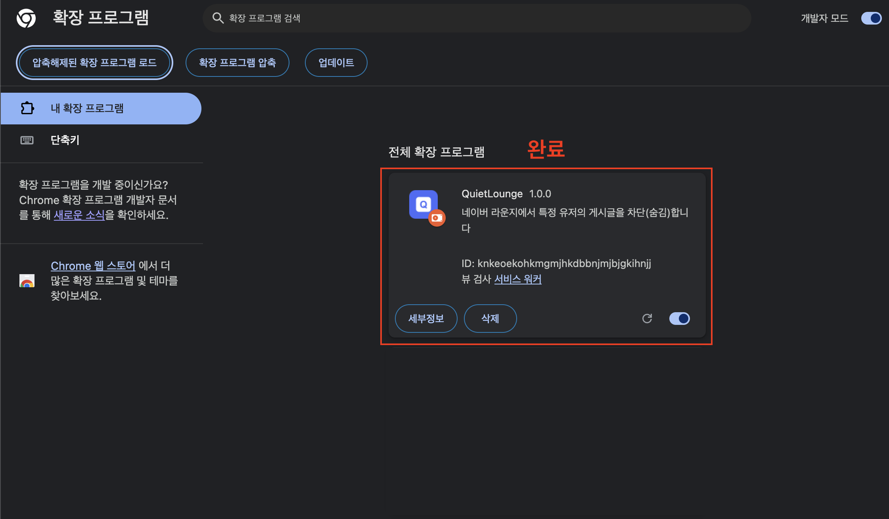

> Edge, Brave, Arc, Opera 등 Chromium 계열 브라우저에서도 동일하게 설치 가능하다.

### 3. 사용

네이버 라운지에 접속하면 자동으로 동작한다. 게시글 닉네임 옆에 **✕** 버튼이 보이면 정상.

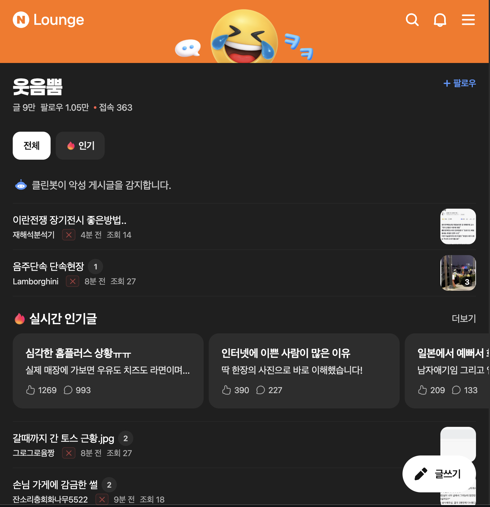
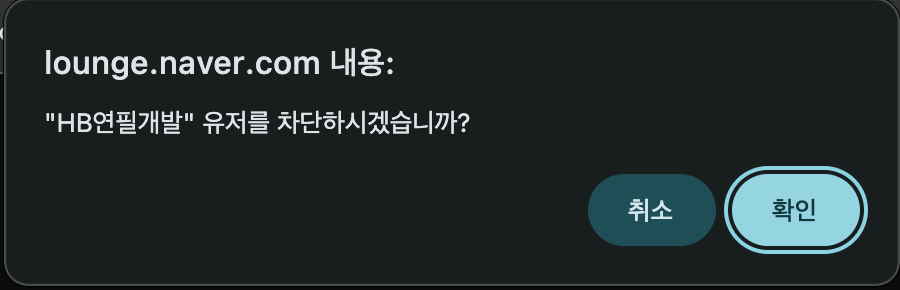

크롬 툴바의 QuietLounge 아이콘을 클릭하면 차단 목록 확인, 해제, 필터 모드 변경(완전 숨김/흐림 처리), 내보내기/가져오기가 가능하다.

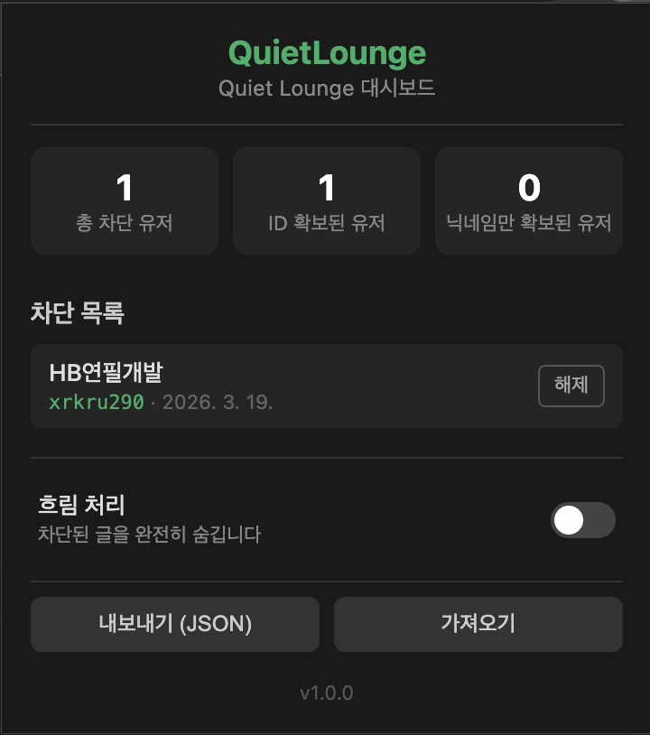

---

## Safari 설치 방법 (macOS / iOS)

Safari 확장 프로그램은 Xcode를 통해 직접 빌드하여 설치한다.

### 1. 요구 사항

- macOS + Xcode (최신 버전 권장)
- iOS 기기 배포 시 Apple Developer 계정 필요

### 2. 빌드

```bash
cd safari-extension/QuietLounge
open QuietLounge.xcodeproj
```

Xcode에서 프로젝트를 열고, 타겟을 선택한 뒤 빌드한다.

- **macOS**: `QuietLounge (macOS)` 타겟 선택 → Run
- **iOS**: `QuietLounge (iOS)` 타겟 선택 → 기기 연결 후 Run

### 3. 확장 프로그램 활성화

**macOS**:
1. Safari → 설정 → 확장 프로그램
2. QuietLounge 체크박스 활성화

**iOS**:
1. 설정 → Safari → 확장 프로그램
2. QuietLounge 활성화
3. 모든 웹사이트 허용 또는 `lounge.naver.com` 허용

### 4. 사용

Chrome 확장 프로그램과 동일하게 네이버 라운지에서 자동으로 동작한다.

iOS 앱에는 내장 브라우저(라운지 탭), 차단 목록, 설정 화면이 포함되어 있어 Safari 없이도 사용할 수 있다.

---

## Android 설치 방법

### 1. 파일 다운로드

위 [다운로드](#다운로드) 링크에서 `QuietLounge-Android.apk`를 받는다.

### 2. APK 설치

다운로드된 APK 파일을 열면 "출처를 알 수 없는 앱" 경고가 나올 수 있다. 설정에서 해당 앱(브라우저 또는 파일 관리자)의 설치를 허용한다.

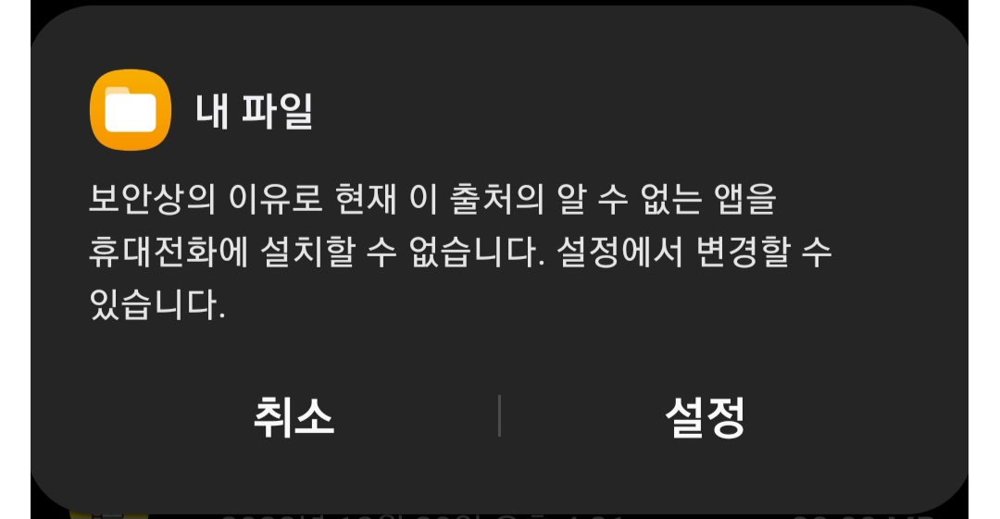

### 3. 사용

앱을 열면 네이버 라운지가 바로 표시된다. PC 버전과 동일하게 **✕** 버튼으로 유저를 차단할 수 있다.

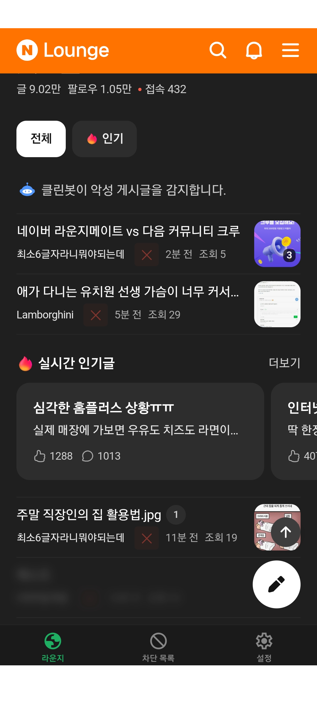
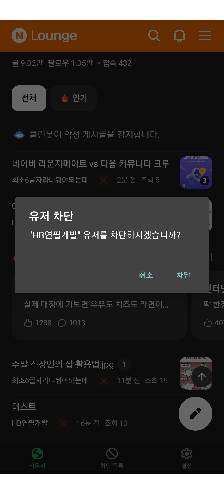

하단 탭에서 차단 목록 확인/해제, 설정(필터 모드 변경, 내보내기/가져오기, 전체 삭제, 키워드 알림)이 가능하다.

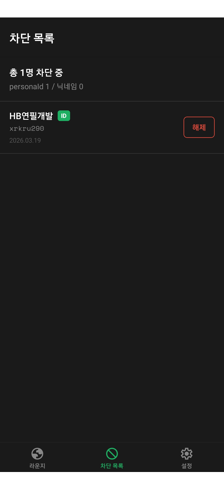
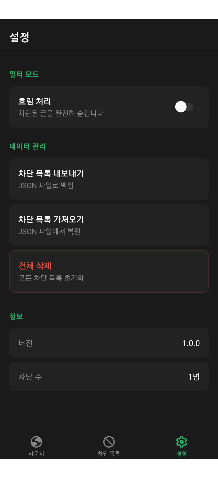

---

## 주요 기능

- **유저 차단**: 닉네임 옆 ✕ 버튼 클릭으로 즉시 차단
- **personaId 기반 추적**: 닉네임을 바꿔도 차단 유지, 이전 닉네임 기록
- **닉네임 차단 → 자동 승격**: personaId 미확보 시 닉네임으로 우선 차단, 이후 자동으로 personaId 보강
- **필터 모드**: 완전 숨김 또는 흐림 처리 선택 가능
- **키워드 알림**: 특정 채널의 새 글을 주기적으로 확인하여 키워드 매칭 시 알림 발송
- **차단 목록 백업**: JSON 내보내기/가져오기로 PC ↔ 앱 간 이동 가능 (키워드 알림 설정 포함)
- **보안**: 네이버 서버에 어떤 데이터도 전송하지 않음. 모든 데이터는 로컬에만 저장

### 키워드 알림

관심 있는 채널에 특정 키워드가 포함된 새 글이 올라오면 알림을 받을 수 있다.

1. 카테고리 → 채널 → 키워드를 설정하면 주기적(1~60분, 기본 5분)으로 새 글을 확인한다.
2. 키워드가 글 제목에 포함되면 알림이 표시되며, 알림을 탭하면 해당 글로 이동한다.

| 플랫폼               | 폴링 방식                              | 백그라운드           | 알림                        |
|-------------------|------------------------------------|-----------------|---------------------------|
| Chrome 확장         | chrome.alarms                      | O (서비스 워커)      | chrome.notifications      |
| Safari 확장 (iOS)   | iOS 컨테이너 앱 Timer (App Group 공유)    | X (앱 포그라운드만)    | UNUserNotificationCenter  |
| Safari 확장 (macOS) | browser.alarms (background page)   | O (Safari 실행 중) | Web Notification API      |
| Android 네이티브      | KeywordAlertScheduler (Coroutines) | X (앱 포그라운드만)    | NotificationManagerCompat |

> - **iOS / Android**: 앱이 포그라운드일 때만 주기적으로 확인하며, 앱을 닫았다가 다시 열면 그동안의 새 글을 한 번에 확인해 알림을 보낸다. iOS Safari 확장은 iOS 컨테이너 앱과 App Group으로 데이터를 공유하므로, 키워드 등록은 어디서 하든 동일하게 동작한다.
> - **macOS Safari 확장**: Safari Web Extension API의 제약(`browser.notifications` 미구현, 익스텐션 origin에서 `Notification.requestPermission` 미동작)을 우회하기 위해, background page가 매칭을 찾으면 `lounge.naver.com` 탭의 content script에 메시지를 보내 거기서 Web Notification을 발송한다. 따라서 **라운지 탭이 한 개 이상 열려 있어야 시스템 알림이 동작**하며, 탭이 없을 때는 툴바 아이콘 뱃지로 매칭 카운트를 표시한다. 권한은 `lounge.naver.com` 페이지에 자동 표시되는 안내 배너에서 한 번만 허용하면 된다.

---

## 보안 및 프라이버시

- **네이버 서버에 어떤 데이터도 전송하지 않는다.** 로그인 정보, 개인정보 수집/외부 전송 코드 없음.
- 차단 데이터는 **브라우저/폰 로컬 저장소에만** 저장된다.
- 크롬 확장 프로그램의 권한은 `lounge.naver.com`에서만 동작하도록 제한되어 있다.

---

## 기술 개요

### personaId 시스템

네이버 라운지는 유저를 8자리 영숫자 `personaId`로 식별한다. 이 ID는 DOM에 직접 노출되지 않지만, API 응답에 포함되어 있다.

QuietLounge는 `fetch`를 monkey-patch하여 API 응답을 가로채고, `postId → personaId` 매핑 테이블을 실시간으로 구축한다.

### 이중 매칭

1. 게시글의 `postId`로 personaId 매핑 테이블 조회
2. personaId가 있으면 → personaId로 차단 판단 (정확)
3. personaId가 없으면 → 닉네임으로 차단 판단 (폴백)

### 프로젝트 구조

```
shared/                          공통 모듈 (TypeScript)
├── types.ts                     타입 정의
└── block-list.ts                차단 목록 관리 (StorageAdapter 패턴)

chrome-extension/                Chrome Extension (Manifest V3)
├── manifest.json
├── content-scripts/
│   ├── main.js                  콘텐츠 스크립트 (필터링 + 차단 버튼 + 브릿지)
│   └── api-interceptor.js       MAIN world fetch 인터셉터
├── popup/                       차단 관리 팝업 UI
├── background/service-worker.js 뱃지 업데이트 + 키워드 알림 (alarms + notifications)
└── icons/

safari-extension/                Safari Web Extension (macOS + iOS)
└── QuietLounge/
    ├── Shared (Extension)/
    │   ├── Resources/
    │   │   ├── manifest.json    Safari용 매니페스트
    │   │   ├── content-scripts/
    │   │   │   ├── main.js      콘텐츠 스크립트 (Safari 대응 + macOS 알림 권한 배너)
    │   │   │   ├── api-interceptor.js
    │   │   │   ├── injector.js  MAIN world 주입 (Safari는 world:"MAIN" 미지원)
    │   │   │   └── storage-bridge.js  iOS App Group 브릿지 (popup/content → 네이티브)
    │   │   ├── popup/           팝업 UI
    │   │   └── background/      background page (storage 브릿지 + macOS 키워드 알림)
    │   └── SafariWebExtensionHandler.swift  iOS App Group UserDefaults 라우터
    ├── iOS (App)/               iOS 컨테이너 앱 (WebView + 탭)
    │   ├── WebViewController.swift
    │   ├── BlockListViewController.swift
    │   ├── SettingsViewController.swift
    │   ├── BlockDataManager.swift           App Group UserDefaults 래퍼
    │   ├── KeywordAlertManager.swift        iOS 키워드 알림 (Timer + UNUserNotificationCenter)
    │   └── WebViewScripts.swift
    └── macOS (App)/             macOS 컨테이너 앱 (단순 컨테이너, 모든 로직은 익스텐션이 담당)

android-app/                     네이티브 Android 앱 (Kotlin + Jetpack Compose)
├── build.gradle.kts             ktlint subproject 적용
├── gradle/libs.versions.toml    버전 카탈로그 (Kotlin / Compose / Coroutines 등)
└── app/
    ├── build.gradle.kts         R8 minify + resource shrink + bundle split
    ├── proguard-rules.pro       JavascriptInterface / kotlinx.serialization 보존 규칙
    └── src/main/
        ├── AndroidManifest.xml
        ├── kotlin/kr/konempty/quietlounge/
        │   ├── QuietLoungeApplication.kt    알림 채널 등록
        │   ├── MainActivity.kt              Splash → MainScreen 전환, 알림 클릭 처리
        │   ├── data/
        │   │   ├── BlockListData.kt         shared/types.ts 의 Kotlin 포팅
        │   │   ├── BlockListEngine.kt       shared/block-list.ts 포팅
        │   │   ├── BlockListRepository.kt   DataStore Preferences + Flow
        │   │   ├── KeywordAlert.kt
        │   │   ├── KeywordAlertRepository.kt
        │   │   ├── MyStatsRepository.kt     내 활동 통계
        │   │   └── PreferencesKeys.kt
        │   ├── network/LoungeApi.kt         api.lounge.naver.com 호출
        │   ├── notification/
        │   │   ├── NotificationHelper.kt    NotificationManagerCompat 발송
        │   │   └── KeywordAlertScheduler.kt 코루틴 기반 포그라운드 폴링
        │   ├── webview/
        │   │   ├── NativeBridge.kt          JavascriptInterface (window.QuietLounge)
        │   │   └── WebViewScripts.kt        before/after.js 로드 + 동적 치환
        │   └── ui/
        │       ├── SplashScreen.kt          iOS SplashViewController 와 동일 디자인
        │       ├── MainScreen.kt            Scaffold + NavigationBar (3탭)
        │       ├── theme/{Color,Theme,Type}.kt
        │       ├── lounge/                  WebView Composable + ViewModel
        │       ├── blocklist/               LazyColumn + ViewModel
        │       └── settings/                통계/필터/키워드알림/데이터관리 + 다이얼로그
        └── assets/webview-scripts/
            ├── before.js                    fetch monkey-patch (mobile-app 의 buildBeforeScript 분리)
            └── after.js                     필터링 + 차단 버튼 + 프로필 통계 (placeholder 치환)

.github/workflows/build.yml      GitHub Actions 빌드 (수동 실행)
                                  - Safari iOS/macOS 컴파일 체크 (서명 없이)
                                  - Chrome ZIP / Android APK 빌드 + Release 생성
```

---

## 차단 데이터 구조

```json
{
  "version": 2,
  "blockedUsers": {
    "92nccavj": {
      "personaId": "92nccavj",
      "nickname": "닉네임",
      "previousNicknames": [],
      "blockedAt": "2026-03-17T12:00:00Z",
      "reason": ""
    }
  },
  "nicknameOnlyBlocks": [],
  "personaCache": {}
}
```

- `blockedUsers` — personaId 확보된 차단 유저 (닉네임 변경 시에도 차단 유지)
- `nicknameOnlyBlocks` — personaId 미확보 임시 차단 (추후 자동 승격)
- `personaCache` — 수집된 personaId-닉네임 매핑 캐시 (내보내기 시 제외)

---

## 개발

### 린팅

```bash
# 루트 (shared + chrome-extension + tampermonkey)
npm run lint        # ESLint 검사
npm run lint:fix    # 자동 수정
npm run format      # Prettier 포맷팅

# 모바일 앱
cd mobile-app
npm run lint        # ESLint 검사
```

### 모바일 앱 로컬 빌드

```bash
# Android (네이티브, Kotlin + Compose)
cd android-app
./gradlew :app:assembleRelease    # APK

# iOS — Safari Web Extension + 네이티브 컨테이너
open safari-extension/QuietLounge/QuietLounge.xcodeproj
```

> Android release 빌드를 하려면 `android-app/release.keystore` (서명 키) 와 `android-app/release.keystore.properties` (`storeFile`, `storePassword`, `keyAlias`, `keyPassword`) 가 필요하다. 이 파일들은 `.gitignore` 처리되어 있다.

---

## 주의사항

- 네이버 라운지의 DOM 구조나 API가 변경되면 업데이트가 필요할 수 있다.
- 차단 데이터는 로컬에만 저장된다. 브라우저/앱 초기화 시 데이터가 사라지므로 정기적인 백업을 권장한다.

---

## 라이선스

MIT
